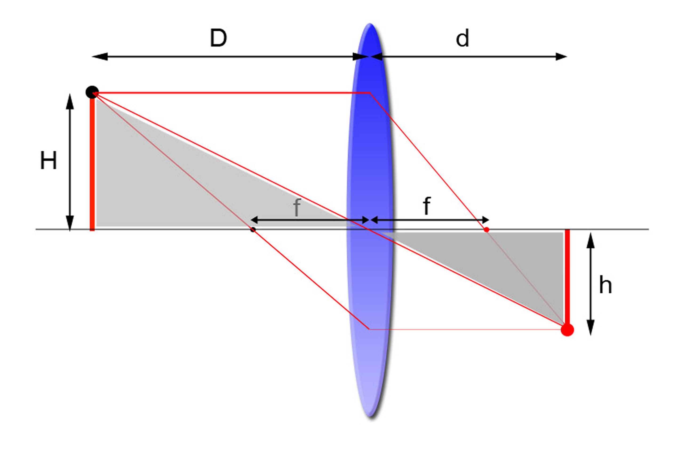
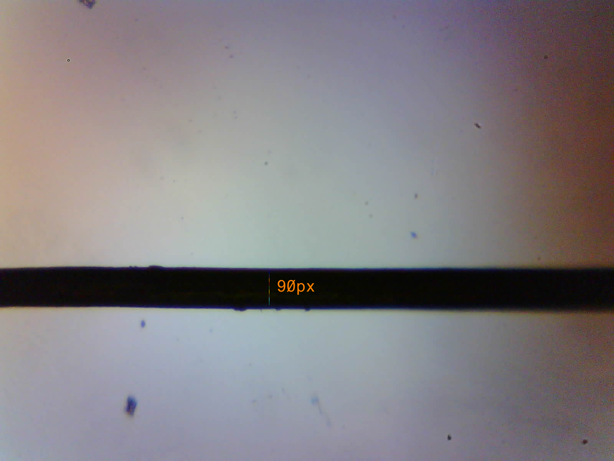

# EcoLens_MycroAnalizer

Tu use this code, the file "pythonLIB.bat" has to be executed

To run the code:
1. Change the network name and password on the file .ino
2. Compile and upload the file .ino to the ESP32-CAM
3. Get the ip direction of the ESP32-CAM and write it on the .py files
4. Run the file Test_Webserver.py

## Magnificación Óptica

La magnificación óptica pasiva se realiza a través de modificar la distancia del lente teniendo en cuenta la siguiente ecuación:

$$ \frac{1}{f} = \frac{1}{d} + \frac{1}{D} $$

$$ m = \frac{h}{H} = \frac{d}{D}  $$

Para el caso en concreto de la cámara OV2640 se tienen las siguientes especificaciones en cuanto al sensor y el lente de la cámara:

<table>
<tr><td>Sensor OV2640</td><td></td></tr>
<tr><td>Resolución</td><td>1600x1200 (2mp)</td></tr>
<tr><td>Tamaño</td><td>3590μmx2684μm</td></tr>
<tr><td>Tamaño del píxel</td><td>2.2μmx2.2μm</td></tr>
</table>

<table>
<tr><td>Lente del OV2640</td><td></td></tr>
<tr><td>Longitud Focal</td><td>4.8mm±5%</td></tr>
<tr><td>Apertura</td><td>2.4±5%</td></tr>
<tr><td>Campo de visión</td><td>65°</td></tr>
</table>

Tomando en cuenta que la distancia entre el lente y el sensor es de D=11mm para el microscopio, el desarrollo que se emplea para determinar el tamaño de cada píxel en la imagen es:

$$ \frac{1}{f} = \frac{1}{d} + \frac{1}{D} = \frac{1}{\frac{h}{H}D}+\frac{1}{D}$$

$$ \frac{1}{4.8mm} = \frac{1}{\frac{h}{3590\mu m}11mm}+\frac{1}{11mm}$$

$$ h=2077.94\mu m$$

$$ h_{pixel}= \frac{h}{1600} = \frac{2077.94\mu m}{1600} = 1.7370\mu m$$

Para realizar la validación de los cálculos se tomó una captura a un pelo cuyo tamaño esperado esta entre los 11μm y 170μm de modo que se contó cuantos pixeles tiene de ancho en la imagen tal y como se observa a continuación:

teniendo en cuenta que el ancho es de aproximadamente 90 pixeles, al realizar el cálculo da que el grosor del cabello es de:

$$ Ancho=90*1.7370\mu m = 156.33\mu m$$

lo cual entra dentro del rango esperado del grosor del cabello.
